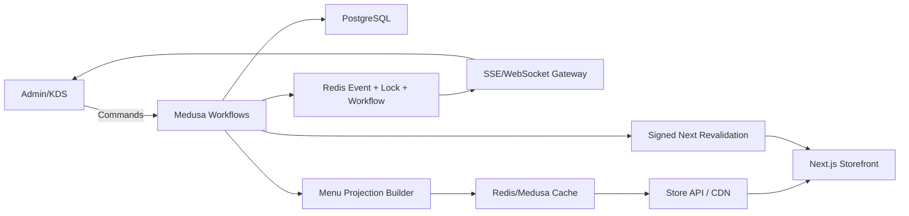

# تقرير التدقيق الشامل لأدمن Medusa ومنصة Umami

**تاريخ التدقيق:** 31 يوليو 2026  
**النطاق:** `apps/backend` و`apps/storefront` وقاعدة PostgreSQL المحلية، مع مراجعة التعديلات المحلية غير الملتزمة الموجودة وقت التدقيق.  
**الإصدار الفعلي:** Medusa `2.18.0`، Next.js `15.5.21`، React `19.0.5` في الواجهة، Node الحالي `22.19.0`، pnpm `11.5.3`.

> هذا تقرير قراءة وتحليل. لم تُعدَّل ملفات التطبيق القائمة ولم تُعرض أسرار `.env`. التعديلات المحلية الحالية اعتُبرت جزءًا من الحالة التي يجري تقييمها.

---

## 1. الخلاصة التنفيذية

المشروع نجح في الوصول إلى **MVP قابل لتجربة طلب مطعم من البداية إلى النهاية**، لكنه لم يصل بعد إلى **أدمن تشغيل مطعم جاهز للإطلاق العام**. الأساس التقني جيد: Medusa v2، متجر Next.js، وحدة مطعم مخصصة، إضافات منتجات، فروع، وحالة مطبخ. المشكلة ليست غياب كل شيء، بل أن الموجود مبني كمسار تجريبي محدود ولا يفرض بعد جميع قواعد صحة الطلب ولا يمنح صاحب المطعم التحكم الفوري والمرن الذي يحتاجه في التشغيل اليومي.

الحكم العملي:

| المجال | التقييم الحالي | الحكم |
|---|---:|---|
| التجارة الأساسية في Medusa | 7/10 | موجودة وتعمل للـMVP |
| نموذج المطعم المخصص | 4/10 | بداية جيدة لكنه مسطح وغير مرتبط بوحدات Medusa كما يجب |
| تجربة صاحب المطعم | 3/10 | توجد صفحات أولية، لكنها لا تكفي للتشغيل السريع |
| صحة الطلب والتسعير | 4/10 | التحقق من الإضافات جيد، لكن order type/branch/shipping غير موحد ذريًا |
| سرعة شاشة المطبخ | 3/10 | polling كل 6 ثوانٍ وحمولة كبيرة، وليس real-time |
| المرونة والإعداد من الأدمن | 3/10 | كثير من النصوص والسياسات ثابتة في الكود أو seed |
| الأمان والصلاحيات والتدقيق | 2/10 | مصادقة Medusa موجودة؛ RBAC وتدقيق العمليات والحماية المخصصة ناقصة |
| الاختبارات وبوابات الجودة | 2/10 | توجد smoke scripts واختبارات شكلية، لكن بوابة الاختبار الحالية لا تختبر فعليًا |
| الجاهزية للإنتاج | 2/10 | دفع تجريبي، لا Redis production modules، لا مراقبة/نسخ احتياطي/إشعارات إنتاجية |

**القرار:** لا تبدأ توسعة الواجهة المخصصة اعتمادًا على العقود الحالية قبل إكمال عناصر P0 في هذا التقرير. يمكن تطوير التصميم بالتوازي، لكن لا ينبغي تثبيت checkout أو قائمة الطعام أو تتبع الطلب على API الحالية قبل إصلاح صحة الطلب، نموذج الفروع، التوفر، والكاش.

---

## 2. ما هو موجود فعليًا

### 2.1 البنية العامة

- Monorepo بـpnpm وTurbo.
- Backend Medusa v2 مع Admin مضمّن في `apps/backend`.
- Storefront Next.js في `apps/storefront`.
- PostgreSQL محلي متصل حاليًا، مع دعم Neon في القوالب.
- وحدة مخصصة باسم `restaurant` مسجلة في `medusa-config.ts`.
- Translation Module مفعّل في التعديلات المحلية الحالية.
- لا يوجد Redis مفعّل في الإعداد الفعلي.
- لا يوجد file provider إنتاجي، notification provider، payment provider بحريني، أو observability provider مهيأ.

### 2.2 حالة قاعدة البيانات وقت التدقيق

فحص قراءة فقط أعطى:

| الجدول/الكيان | العدد |
|---|---:|
| فروع المطعم | 1 |
| مجموعات الإضافات | 2 |
| خيارات الإضافات | 6 |
| روابط المنتج بمجموعات الإضافات | 2 |
| سجلات حالة المطعم | 2 |
| أحداث انتقال الحالة | 11 |
| منتجات Medusa | 4 |
| تصنيفات | 4 |
| مواقع مخزون | 1 |
| خيارات شحن | 2 |
| طلبات Medusa | 5 |

ملاحظتان مهمتان:

- الطلبان الموجود لهما `restaurant_order` مكتملان وبهما `order_type` و`branch_id`.
- توجد **3 طلبات Medusa بلا سجل `restaurant_order`**. قد تكون طلبات أقدم من subscriber، لكنها تثبت الحاجة إلى backfill وعدم الاعتماد على إنشاء السجل عند فتح صفحة الحالة.

### 2.3 إمكانات Medusa الأصلية المتاحة

هذه لا ينبغي إعادة بنائها داخل plugin مخصص:

- المنتجات، المتغيرات، الخيارات، التصنيفات، المجموعات، الوسوم، والصور.
- Price Lists والأسعار حسب العملة/المنطقة.
- المخزون، Inventory Items، Stock Locations والحجوزات.
- Regions، Sales Channels، Publishable API Keys.
- Fulfillment Sets، Service Zones، Shipping Options.
- الطلبات، المدفوعات، refunds، fulfillment، returns، exchanges وclaims.
- العملاء، العناوين، الحسابات.
- Promotions والحملات.
- المستخدمون والدعوات والمصادقة وMFA المتاحة في الإصدار.
- الضرائب عبر Tax Module/provider.
- Translation Module للكيانات التي يدعمها Medusa.

المطلوب هو **تبسيط هذه الإمكانات لصاحب المطعم وربطها بسياسات المطعم**، لا إنشاء نظام تجارة موازٍ.

### 2.4 التخصيص الموجود للمطعم

#### نماذج البيانات

- `restaurant_branch`: الاسم، slug، الهاتف، العنوان، active، قبول توصيل/استلام، دقائق التحضير، و`opening_hours_json`.
- `restaurant_modifier_group`: single/multiple، required، min/max، ترتيب.
- `restaurant_modifier_option`: الاسم، زيادة السعر، default، active، ترتيب.
- `restaurant_product_modifier_group`: يخزن `product_id` كنص ويربطه بمجموعة إضافات.
- `restaurant_order`: `order_id`، حالة المطبخ، النوع، الفرع وآخر انتقال.
- `restaurant_order_status_event`: سجل انتقال الحالة والمستخدم والملاحظة.

#### Admin API

- CRUD أولي للفروع.
- CRUD جزئي لمجموعات وخيارات الإضافات.
- ربط مجموعة إضافات بمنتج.
- قائمة طلبات مطبخ نشطة.
- قراءة وتغيير حالة المطبخ.

#### Store API

- قائمة الفروع النشطة.
- إضافات منتج.
- إضافة line item مع إضافات متحقق منها على الخادم.
- حفظ `order_type` و`branch_id` في metadata السلة.
- قراءة حالة مطبخ الطلب.

#### واجهة الأدمن

- صفحة الفروع.
- صفحة مجموعات الإضافات وتفاصيل المجموعة.
- widget على المنتج لربط مجموعات الإضافات.
- widget على الطلب يعرض metadata والإضافات.
- widget لحالة المطبخ وسجلها.
- صفحة Kitchen Orders جديدة بتبويبات وأزرار انتقال سريع.
- ترجمة أولية إنجليزية/عربية لتخصيصات الأدمن.

#### الواجهة

- قائمة منتجات حسب التصنيف.
- modal منتج مع variants وmodifiers وملاحظات وكمية.
- سلة وcheckout وتسليم/استلام واختيار فرع.
- صفحة نجاح تعرض حالة المطبخ والفرع ووقت التحضير.
- بداية ترجمة عربية/إنجليزية.

---

## 3. نقاط القوة التي يجب الحفاظ عليها

1. **التحقق من سعر الإضافات على الخادم:** الواجهة لا تفرض سعرًا موثوقًا؛ الخادم يعيد قراءة الخيارات ويحسبها.
2. **Snapshot للإضافات في line item metadata:** يحفظ أسماء وسعر الإضافات وقت الطلب فلا تتغير الفاتورة القديمة عند تعديل القائمة.
3. **فصل حالة المطبخ عن حالات payment/fulfillment:** قرار صحيح لأن `preparing` و`ready` ليست بديلًا عن حالة الدفع أو الشحن.
4. **قواعد انتقال حالة واضحة:** لا يمكن الانتقال مباشرة من received إلى ready، ولا يمكن pickup أن يصبح out_for_delivery.
5. **سجل أحداث الحالة:** قاعدة جيدة للتدقيق، مع ضرورة جعله ذريًا وإثرائه لاحقًا.
6. **استخدام Workflows في إضافة line item وحفظ metadata:** الاتجاه مناسب لـMedusa v2.
7. **استخدام Admin routes/widgets بدل تعديل ملفات Medusa الداخلية:** قابل للصيانة والترقية.
8. **seed قابل لإعادة التشغيل نسبيًا:** مناسب للبيئة التجريبية، بعد فصل seed التجريبي عن bootstrap الإنتاجي.

---

## 4. أخطر النواقص الحالية — P0

### P0.1 لا يوجد مصدر حقيقة واحد لـDelivery/Pickup والفرع والشحن

حاليًا:

- `order_type` و`branch_id` يحفظان في `cart.metadata.restaurant` عبر endpoint مخصص.
- Shipping Method يختار في مسار Medusa مستقل.
- لا يوجد workflow واحد يحدّث الاثنين معًا.
- لا يوجد `completeCartWorkflow.validate` يرفض عدم التطابق قبل إنشاء الطلب.

النتيجة المحتملة:

- metadata تقول pickup بينما Shipping Option هو delivery أو العكس.
- رسوم غير متوافقة مع النوع.
- فرع في metadata لا يطابق Stock Location/Fulfillment Set المستخدم.
- الدفع يُفوض على إجمالي ثم تتغير طريقة الشحن من مسار منفصل.

**الحل المطلوب:** workflow واحد باسم قريب من `setRestaurantFulfillmentIntentWorkflow` يستقبل cart، branch، order type وربما zone؛ يتحقق من فتح الفرع وقدرته والتوفر، يختار Shipping Option المرتبط بالفرع والنوع، يحدث metadata والشحن معًا، ثم يحدّث totals/payment collection حسب مسار Medusa. بعد ذلك hook قراءة فقط في `completeCartWorkflow.validate` يعيد التحقق من invariant ولا يعدّل cart.

### P0.2 الفرع ليس مرتبطًا فعليًا بوحدات Medusa

`restaurant_branch` لا يملك روابط رسمية إلى:

- Stock Location.
- Fulfillment Set / Service Zone.
- Sales Channel.
- Shipping Options الخاصة بالفرع.
- قائمة المنتجات/التوفر/السعر في الفرع.

الـseed ينشئ `Main Branch` مرتين كمفهومين يحملان الاسم نفسه: سجل مطعم وموقع مخزون، بلا علاقة رسمية بينهما.

**الحل:** استخدم Medusa Module Links بدل تخزين IDs كنصوص معزولة. عرّف روابط branch↔stock_location، branch↔fulfillment_set أو shipping options بحسب التصميم، وproduct↔restaurant configuration. توثيق Medusa يوصي بالـModule Links لربط نماذج الوحدة المخصصة بوحدات التجارة.

### P0.3 ساعات العمل موجودة كـJSON غير متحقق منه ولا تطبق

- API يقبل `opening_hours_json: unknown`.
- لا يوجد timezone.
- لا يوجد overnight interval مضبوط.
- لا توجد استثناءات/إجازات أو إغلاق مؤقت.
- لا تتحقق Store API أو checkout من أن الفرع مفتوح.
- لا يوجد زر “إيقاف الطلبات الآن”.

**الحل:** نماذج typed لـweekly schedule وspecial closures، timezone `Asia/Bahrain` افتراضيًا، وحالة تشغيل مشتقة: `open | closed | paused | at_capacity`. كل إضافة للسلة وإكمال طلب يعيدان التحقق على الخادم.

### P0.4 التوفر والمخزون غير صالحين للإطلاق

- كل demo variants تستخدم `manage_inventory: false`.
- لا يوجد نفاد صنف سريع “86 item”.
- لا يوجد توفر حسب الفرع أو الفترة أو نوع الطلب.
- لا توجد حجوزات مخزون لأن إدارة المخزون معطلة.
- الإضافات نفسها لا تملك مخزونًا أو حدودًا مرتبطة بالمكونات.

**الحل:** افصل بين:

- `operational availability`: زر فوري لإيقاف صنف/variant/modifier في فرع.
- `inventory availability`: Medusa Inventory للمواد/الوحدات التي يلزم تتبعها.
- `scheduled availability`: فطور/غداء/عرض محدود.

ابدأ بـoperational availability per branch، ثم فعّل مخزون Medusa للأصناف التي تحتاج منع overselling.

### P0.5 endpoint حالة الطلب العام يكتب في قاعدة البيانات

`GET /store/restaurant/orders/:id/status` ينشئ `restaurant_order` إن لم يجده. هذا يعني أن endpoint قراءة عام يمكنه توليد بيانات، ولا يتحقق من ملكية الطلب أو token مخصص.

**المخاطر:** abuse، تضخم جداول، تسريب حالة/فرع لمن يعرف order ID، وإخفاء فشل subscriber بدل كشفه.

**الحل:**

- GET لا يكتب مطلقًا.
- السجل ينشأ ضمن workflow موثوق أو subscriber durable مع backfill job.
- التحقق عبر customer session أو order access token موقّع قصير/طويل المدة حسب سياسة guest orders.
- endpoint يرجع أقل قدر من البيانات، مع rate limiting.

### P0.6 انتقالات حالة المطبخ ليست ذرية أو محمية من السباق

العملية الحالية: اقرأ status، حدّث `restaurant_order`، ثم أنشئ event. لا lock ولا optimistic version ولا transaction/workflow compensation واضح.

في ضغط مزدوج يمكن لمستخدمين قبول/تحديث الطلب في الوقت نفسه، أو تحديث الحالة ثم يفشل إنشاء event.

**الحل:** workflow ذري مع lock على `restaurant-order:{orderId}`، optimistic version أو compare-and-set، وتحديث الحالة + event في transaction واحدة. في production استخدم Redis أو PostgreSQL Locking Provider؛ in-memory lock مناسب للتطوير فقط.

### P0.7 بوابات الجودة لا تعمل

التحقق الفعلي وجد:

- `pnpm test` ينجح لكن Turbo لا يشغل أي task: **0 tests**.
- `test:unit` يستخدم syntax بيئة Unix ولا يعمل على Windows.
- Jest يشير إلى `integration-tests/setup.js` غير موجود.
- اختبارات modifiers/status تنسخ المنطق في test بدل اختبار service الحقيقي، فتستطيع الخدمة أن تنكسر والاختبار يظل أخضر.
- Backend TypeScript يحتوي أخطاء في JSON imports، branch schemas، store status route، والـseed.
- Storefront TypeScript نجح، لكن `next.config.js` يحتوي `ignoreBuildErrors: true` و`eslint.ignoreDuringBuilds: true`.
- `next lint` deprecated.
- build الواجهة يعتمد على تنزيل Google Fonts وقت البناء؛ فشل في البيئة المقيدة.

**الحل:** لا عمل وظيفي جديد قبل جعل typecheck/lint/unit/integration/build بوابات حقيقية محلية وCI.

---

## 5. فجوات نموذج البيانات والمرونة

### 5.1 إعدادات المطعم العامة

لا يوجد كيان منظم لإدارة:

- اسم العلامة والشعار والأيقونة.
- هواتف وفروع وروابط التواصل.
- العملة والمنطقة الزمنية واللغات الافتراضية.
- سياسة الطلب: minimum order، max quantity، notes policy، tips، scheduled ordering.
- مدة التحضير الافتراضية والزيادة اليدوية.
- قبول الطلب تلقائيًا أو يدويًا.
- حالة المتجر: مفتوح/مغلق/متوقف مؤقتًا.
- قنوات الإشعار والطباعة.
- شروط الاستخدام والخصوصية وسياسة الإلغاء.

أنشئ `RestaurantSettings` singleton منظمًا ومتحققًا، ولا تجعل metadata مستودعًا نهائيًا لكل شيء.

### 5.2 الفروع

النموذج الحالي يحتاج:

- timezone، latitude/longitude، وصف وتعليمات الاستلام.
- contact email/WhatsApp.
- weekly hours + exceptions.
- temporary pause + reason + resume_at.
- capacity: max active orders أو orders/slot.
- prep time base/current override/min/max.
- links إلى stock location وfulfillment.
- minimum order وfees وسياسات حسب delivery/pickup.
- active ليس كافيًا؛ الحذف يجب أن يكون soft/archival مع حماية المراجع.

واجهة الأدمن الحالية تسمح بالإنشاء والتفعيل فقط تقريبًا؛ لا يوجد edit كامل للساعات والسياسات أو معاينة “هل الفرع مفتوح الآن؟”.

### 5.3 القائمة Menu ككيان تشغيلي

التصنيفات والمنتجات الأصلية في Medusa مهمة، لكنها لا تكفي لإدارة عرض مطعم مرن. المطلوب طبقة presentation/operations:

- Menu واحد أو أكثر: delivery، pickup، breakfast، seasonal.
- Menu Sections بترتيب وعنوان وترجمة وصورة اختيارية.
- ربط section بمنتجات مع ترتيب مستقل.
- نشر draft/published مع preview.
- schedule للمنيو أو section.
- featured/bestseller/badge.
- availability per branch.
- override اسم/وصف قصير في سياق المنيو عند الحاجة، مع عدم نسخ كامل بيانات المنتج.

### 5.4 الإضافات Modifiers

الموجود مناسب لحالة بسيطة لكنه ينقصه:

- تحرير وحذف وترتيب drag/drop من الأدمن.
- duplicate group وbulk attach.
- ترجمة أسماء المجموعات والخيارات.
- وصف/صورة/allergen للخيارات.
- quantity per option مثل “2 صوص”.
- free allowance: أول خيارين مجانًا ثم السعر.
- per-product override للrequired/min/max/default/price/order.
- applicability حسب variant.
- price حسب branch/region/currency.
- schedule/availability per branch.
- SKU أو inventory item اختياري للإضافة.
- قواعد default صحيحة: single له default واحد فقط؛ عدد defaults لا يتجاوز max.
- constraints في schema: `min <= max` وsingle max=1 وقيم منطقية.
- uniqueness لـproduct+modifier group لمنع duplicate race.

لا تبدأ nested conditional modifiers في المرحلة الأولى إلا إذا احتاجها المنيو الحقيقي. صمم schema قابلة للتوسعة، لكن نفّذ single/multiple + per-product overrides أولًا.

### 5.5 الطلب التشغيلي

`restaurant_order` يحتاج حقولًا منظمة بدل الاعتماد على metadata:

- branch snapshot وbranch link.
- order_type كمصدر حقيقة.
- promised_at، estimated_ready_at، scheduled_for.
- accepted_at/preparing_at/ready_at/completed_at/cancelled_at.
- rejection/cancellation reason code + note.
- source: web/admin/POS.
- customer-facing status منفصل عند الحاجة.
- kitchen ticket number/day sequence.
- version للتزامن.
- assigned station/courier لاحقًا.
- SLA indicators.

احفظ snapshot الضروري داخل الطلب، مع إبقاء الروابط المرجعية. لا تعتمد على أسماء حية فقط.

### 5.6 المحتوى والهوية

حاليًا `Umami`، hero، “Featured”، metadata، footer وبعض النصوص ثابتة في الواجهة. المطلوب من الأدمن:

- Brand settings.
- SEO defaults وsocial images.
- homepage blocks منظمة: hero، categories، featured، banner، announcement.
- ترتيب وتشغيل/إخفاء كل block.
- نص وصورة وCTA وترجمة.

استخدم content block schema محددة بإصدار، وليس page builder حرًا في البداية. هذا يعطي مرونة بلا فوضى أو مخاطر HTML.

---

## 6. فجوات تجربة صاحب المطعم في الأدمن

### 6.1 لوحة تحكم تشغيلية

يجب أن تفتح على معلومات قابلة للتصرف:

- طلبات جديدة تحتاج قبولًا.
- قيد التحضير/متأخرة/جاهزة.
- حالة المطعم والفروع الآن.
- زر Pause Orders مع مدة وسبب.
- current prep time مع +5/+10 دقيقة.
- الأصناف الموقوفة الآن.
- مبيعات اليوم، عدد الطلبات، average order value، acceptance/prep time.
- تنبيهات فشل دفع/إشعار/طابعة.

### 6.2 شاشة المطبخ KDS

الحالية جيدة كprototype، لكنها تحتاج:

- real-time أو شبه فوري بدل 6 ثوانٍ.
- صوت وتنبيه بصري للطلب الجديد مع acknowledge.
- grouping حسب الحالة والفرع والمحطة.
- ألوان SLA وتوقيت منذ الوصول.
- تفاصيل modifiers والملاحظات بخط واضح.
- accept/reject مع سبب ووقت متوقع.
- طباعة أو kitchen ticket.
- offline/reconnect indicator.
- pagination/infinite أو windowing بدل حد ثابت 50.
- history منفصل للطلبات المكتملة/الملغاة.
- دعم tablet وشاشة كبيرة مع أزرار كبيرة.

### 6.3 إدارة القائمة اليومية

يحتاج صاحب المطعم عمليات من نقرة واحدة:

- إيقاف صنف/variant/modifier في فرع.
- إعادته الآن أو في وقت محدد.
- تعديل وقت التحضير.
- تغيير ترتيب قسم/منتج.
- نشر تغييرات مجمعة بعد preview.
- معرفة أين سيظهر التعديل وأي فروع سيتأثر بها.

### 6.4 إدارة الفروع والتوصيل

- خريطة أو مناطق polygon/radius لاحقًا، مع مناطق بريدية/محافظات إن كانت أدق للبحرين.
- رسوم flat/tiered/free-over-threshold.
- حد أدنى للطلب.
- مدة توصيل تقديرية.
- إغلاق منطقة مؤقتًا.
- اختيار أقرب/أنسب فرع أو فرض فرع محدد.
- منع العميل من اختيار فرع لا يغطي عنوانه.

### 6.5 الموظفون والصلاحيات

Medusa يدير admin users والدعوات والمصادقة، لكن المشروع لا يفرض أدوار مطعم. المطلوب طبقة authorization واضحة:

- Owner: كل شيء.
- Manager: التشغيل والقائمة والتقارير دون أسرار التكاملات.
- Kitchen: قراءة الطلب وتغيير حالات مسموحة فقط.
- Cashier: الطلبات والعملاء والدفع المحدود.
- Content editor: المحتوى والقائمة دون أسعار/مدفوعات إن رغبت.

كل Admin API مخصص يجب أن يطبق permission check، لا يكتفي بأن المسار `/admin` مصادق. سجّل actor وbefore/after في audit log للعمليات الحساسة.

---

## 7. الأداء وسرعة الاستجابة

### 7.1 مشاكل الأداء الحالية

1. شاشة المطبخ تجلب حتى 50 طلبًا مع كل items وmetadata كل 6 ثوانٍ.
2. query الطلبات يقرأ بيانات Medusa كاملة نسبيًا كل مرة، بلا `updated_since` أو ETag.
3. لا يوجد index مركب على `restaurant_order(status, created_at)`.
4. لا يوجد index على `restaurant_product_modifier_group(product_id)` ولا unique على product/group.
5. Storefront يجلب حتى 100 منتج مع حقول كثيرة، ويجلب التصنيفات مع `*products`، فتتكرر بيانات.
6. modifiers تُجلب بعد فتح modal؛ أول تفاعل ينتظر round trip إضافية.
7. `force-cache` مستخدم للمنتجات/modifiers، لكن لا يوجد revalidation endpoint/subscribers عند تعديل الأدمن.
8. أخطاء branches/modifiers/status تُبتلع وتتحول إلى array فارغ أو null، فيبدو العطل كأنه “لا توجد بيانات”.
9. `images.unoptimized: true` يعطل تحسين صور Next.
10. build يعتمد على Google Fonts عبر الشبكة.

### 7.2 البنية الموصى بها للسرعة

#### المسار الساخن: الطلبات والتوفر

- command صغير ومحدد، transaction/lock، response سريع.
- Optimistic UI مع rollback ورسالة نجاح واضحة.
- emit event بعد commit.
- KDS يستقبل event عبر SSE أو WebSocket؛ fallback polling متدرج عند انقطاع الاتصال.
- list endpoint يعيد summary فقط؛ details endpoint عند فتح البطاقة.
- `updated_since`/cursor وpagination.
- target داخلي: p95 للعمليات البسيطة أقل من 300–500ms قرب قاعدة البيانات، وظهور الطلب في KDS خلال أقل من ثانيتين في الظروف الطبيعية.

#### المسار المقروء: قائمة العميل

- API projection واحدة حسب `branch + locale + order_type` تضم sections والمنتجات والأسعار والإضافات والتوفر الضروري فقط.
- Cache keys واضحة وTTL مع stale-while-revalidate.
- invalidation event عند product/price/modifier/menu/availability update.
- availability الفورية يمكن أن تكون endpoint خفيفة أو جزءًا قصير TTL بدل إعادة بناء كامل الصفحة.
- Next revalidation موقّع كما توصي وثائق Medusa، لا endpoint عام بلا secret.
- prefetch modifiers للمنتجات الظاهرة أو تضمينها في projection لتجنب تأخر modal.

#### الفهارس المطلوبة مبدئيًا

- `restaurant_order(status, created_at desc) where deleted_at is null`.
- `restaurant_order(branch_id, status, created_at desc)`.
- `restaurant_order(last_transition_at)` عند استخدام cursor/incremental.
- `restaurant_order_status_event(restaurant_order_id, created_at)`.
- `restaurant_product_modifier_group(product_id)`.
- unique جزئي على `(product_id, modifier_group_id)`.
- فهارس availability حسب `(branch_id, resource_type, resource_id)`.

نفّذ الفهارس من migrations مولدة/مراجعة، ثم استخدم `EXPLAIN ANALYZE` ببيانات حجم واقعي.

### 7.3 Redis: متى ولماذا

لا يحتاج MVP محلي Redis، لكن الإنتاج أو أكثر من instance يحتاجه أو بديلًا production-grade للأسباب التالية:

- Event Module المحلي مبني على EventEmitter ومخصص للتطوير.
- Locking الافتراضي in-memory لا يحمي بين instances.
- Workflow Engine الافتراضي in-memory غير durable.
- Caching Module مع Redis يسرع بيانات التجارة ويشارك الكاش بين instances.

إذا كانت الاستضافة Medusa Cloud فلا تسجل هذه الوحدات يدويًا لأن Cloud يهيئها. إذا كانت self-hosted، هيئ Redis Event، Redis Workflow Engine، Redis/PG Locking، وRedis Caching Provider حسب وثائق الإصدار المثبت.

---

## 8. صحة التسعير والمدفوعات

### الموجود

- سعر variant محسوب من Medusa.
- زيادات modifiers تُقرأ من قاعدة البيانات.
- line item يصبح `is_custom_price: true` ويحمل السعر النهائي.

### ما يحتاج قرارًا واختبارات

- أثر `is_custom_price` على promotions والضرائب وprice lists.
- هل modifiers discountable أم لا؟
- tax inclusive/exclusive للإضافات.
- عملة السعر داخل modifier؛ النموذج يفترض BHD فقط.
- rounding لكل line ثم total، خصوصًا BHD بثلاث منازل.
- refunds الجزئية: يجب أن تعرض modifiers في refund context.
- تغيير السعر بين فتح modal والإضافة أو checkout.

### المطلوب قبل الإنتاج

- Payment Provider بحريني حقيقي كـMedusa Payment Module provider، لا منطق داخل الواجهة.
- webhooks موثقة بالتوقيع، idempotent، replay-safe.
- reconciliation dashboard وحالات pending/failed/authorized/captured/refunded.
- عدم اعتبار order accepted في المطبخ إلا وفق سياسة الدفع المختارة.
- سياسة COD إن وجدت.
- اختبارات فشل وتكرار webhook وdouble-click وإعادة المحاولة.

---

## 9. الإشعارات والتكاملات

غير موجود حاليًا ويجب تصميمه event-driven:

- تأكيد الطلب للعميل.
- قبول/رفض وتحديث الوقت.
- جاهز للاستلام/خرج للتوصيل/مكتمل.
- تنبيه الموظفين بطلب جديد.
- قنوات email/SMS/WhatsApp/push حسب الحاجة.
- قوالب عربية/إنجليزية من الأدمن أو provider مع versioning.
- retry وdead-letter/failure dashboard.
- POS والطابعة كـsubscribers/outbox jobs، لا داخل request الساخن.

---

## 10. الأمان والاعتمادية

### نواقص حالية

- لا `src/api/middlewares.ts` فعلي للحماية الإضافية أو rate limiting.
- Store status endpoint بلا ownership token ويكتب عند GET.
- schemas تستخدم `zod` مباشرة؛ وثائق Medusa الحديثة تستخدم `@medusajs/framework/zod` في مساراتها.
- validation ناقص للتواريخ والساعات والslug والهواتف وmin/max/defaults.
- لا audit log شامل.
- لا RBAC مخصص.
- لا idempotency واضحة للأوامر المخصصة.
- حذف branch/group قد يؤثر في مراجع تاريخية لأن IDs نصية بلا علاقات رسمية.
- لا CSP/security headers موثقة للواجهة.
- لا rate limits لـcart custom endpoints.

### المطلوب

- middleware موحد: auth، permission، validation، rate limit، request ID.
- CSRF/session behavior موثق للأدمن.
- secrets منفصلة لكل بيئة ودورانها.
- MFA للمالك والمدير.
- audit log append-only للأوامر الحساسة.
- soft-delete/archive مع قيود مراجع.
- idempotency keys للطلب والدفع والأوامر الخارجية.
- privacy retention/export/delete policy للعملاء.

---

## 11. التشغيل والإنتاج

ينقص المشروع:

- بيئات dev/staging/prod منفصلة.
- CI حقيقي.
- migrations gate وrollback/forward-fix policy.
- health/readiness endpoints.
- structured logs + request/order correlation IDs.
- error tracking وAPM وmetrics.
- dashboards/alerts للطلب والدفع والـsubscriber والـqueue.
- PostgreSQL backups وPITR واختبار restore.
- S3-compatible file provider وCDN للصور.
- local fonts أو build assets موثوقة.
- load/concurrency/soak tests.
- incident runbook.
- seed إنتاجي منفصل لا ينشئ demo catalog ولا يغيّر أول store عشوائيًا.

ملاحظة: seed الحالي يحدث أول Store موجود إلى `Restaurant Demo` وBHD، ويستخدم أول publishable key وأول shipping profile. هذا مقبول لبيئة demo جديدة، وغير آمن كbootstrap عام أو migration تلقائي في بيئة فيها بيانات.

---

## 12. الاختبارات المطلوبة

### Unit

- service الحقيقي للـmodifier validation، لا نسخة من المنطق.
- schema invariants.
- opening hours/timezone/overnight/special closure.
- status state machine.
- fee/minimum/prep calculations.

### Module integration

- CRUD + constraints + module links.
- modifier pricing مع BHD rounding.
- status transition transaction وconcurrency.
- cache invalidation.

### HTTP integration

- permissions لكل Admin route.
- guest/customer access لحالة الطلب.
- rate limiting.
- branch closed/paused/at capacity.
- order type/shipping/branch mismatch rejected.
- invalid modifier/product/variant rejected.

### End-to-end

- pickup كامل.
- delivery كامل.
- out of stock أثناء checkout.
- إغلاق الفرع بعد إضافة السلة.
- تغيير السعر.
- double submit.
- فشل/تأخر webhook.
- KDS يستقبل الطلب ويتعامل مع reconnect.
- refund/cancel.
- عربي/إنجليزي وRTL.

### Performance

- 100–500 طلب نشط في KDS.
- burst طلبات متزامنة.
- concurrent last-item reservation.
- p95/p99 لـmenu، add-to-cart، checkout، KDS command.

---

## 13. ما يبنى Native وما يبنى Custom Plugin

| الحاجة | القرار |
|---|---|
| منتجات/variants/categories/prices | Medusa Native |
| Inventory/Stock Locations | Medusa Native |
| Regions/Sales Channels | Medusa Native |
| Shipping/Service Zones | Medusa Native مع ربط بسياسات الفرع |
| Orders/Payment/Refund/Fulfillment | Medusa Native |
| Promotions/Customers | Medusa Native |
| Restaurant settings/branches/operating state | Custom restaurant module/plugin |
| Menu presentation/schedules/branch availability | Custom plugin مع روابط للمنتجات |
| Modifiers المتقدمة | Custom plugin |
| KDS وحالة المطبخ | Custom plugin، مع عدم خلطها بحالة الدفع |
| Audit/RBAC للمطعم | Custom authorization/audit layer |
| Payment بحريني | Payment provider module |
| Email/SMS/WhatsApp | Notification provider/subscribers |
| POS/printer | Outbox/subscriber integration |

**توصية التغليف:** حافظ الآن على `restaurant` كوحدة محلية منضبطة مع `src/links` وworkflows وAPI وAdmin. عندما تثبت العقود والاختبارات، انقلها إلى plugin داخلي واحد مثل `@umami/medusa-plugin-restaurant` بدل عدة plugins صغيرة متشابكة. لا تجعل التغليف هدفًا يسبق صحة النموذج.

---

## 14. ترتيب التنفيذ المقترح

### المرحلة 0 — بوابة الجودة

- إصلاح scripts وJest وTypeScript وESLint وbuild.
- CI وdatabase test isolation.
- منع ignore build/type errors.

**بوابة الخروج:** كل check يشغل عملًا فعليًا وينجح، ولا توجد أخطاء TypeScript مخفية.

### المرحلة 1 — صحة الطلب

- مصدر حقيقة موحد للفرع والنوع والشحن.
- complete-cart validation.
- branch links.
- public status security.
- transaction/locking للحالات.
- backfill للطلبات القديمة.

**بوابة الخروج:** لا يمكن تكوين أو إكمال طلب متناقض، ولا يكتب GET، وتنجح اختبارات concurrency.

### المرحلة 2 — التشغيل الأساسي

- Settings + hours + pauses + closures + capacity.
- branch operational state.
- per-branch availability و86 item.
- إدارة branch كاملة.

**بوابة الخروج:** صاحب المطعم يفتح/يغلق/يوقف ويغير prep ويوقف صنفًا من الأدمن وتنعكس النتيجة فورًا ويمنع الخادم الطلب غير الصالح.

### المرحلة 3 — KDS سريع

- list summary/cursor/pagination/indexes.
- SSE/WebSocket + fallback.
- sound/ack/SLA.
- atomic commands.

**بوابة الخروج:** الطلب الجديد يظهر خلال أقل من ثانيتين عادة، ولا تضيع أحداث بعد reconnect.

### المرحلة 4 — Menu وModifiers مرنة

- menu/sections/draft-publish/schedule.
- modifier edit/reorder/duplicate/per-product overrides/translations.
- branch/variant applicability.
- menu projection/cache/revalidation.

**بوابة الخروج:** بناء قائمة مطعم حقيقية كاملة من الأدمن دون تعديل كود الواجهة.

### المرحلة 5 — الدفع والإشعارات والصلاحيات

- production payment provider.
- notification providers/templates/retries.
- roles/permissions/audit.
- refunds/cancellations policy.

### المرحلة 6 — الإنتاج والتحليلات

- Redis production modules أو Medusa Cloud managed setup.
- storage/CDN/observability/backups/load tests.
- operational and business dashboards.

---

## 15. قائمة “لا تبدأ الواجهة النهائية قبلها”

- [ ] عقد Menu API ثابت ومكتوب ومُرقّم الإصدار.
- [ ] branch/order type/shipping invariant.
- [ ] تعريف availability وopen/paused/closed.
- [ ] modifiers per-product behavior ثابت.
- [ ] money/rounding/tax/promotion behavior مختبر.
- [ ] guest order status access آمن.
- [ ] cache invalidation من الأدمن إلى الواجهة.
- [ ] contracts عربية/إنجليزية وfallback.
- [ ] error codes قابلة للترجمة بدل رسائل نصية فقط.
- [ ] pagination/cursors للطلبات.
- [ ] webhook/event contracts للتحديث الفوري.

---

## 16. مراجع Medusa الرسمية المستخدمة

- [Module Links](https://docs.medusajs.com/learn/fundamentals/module-links)
- [Admin routing customizations](https://docs.medusajs.com/learn/fundamentals/admin/routing)
- [Caching Module](https://docs.medusajs.com/resources/infrastructure-modules/caching)
- [Event Module](https://docs.medusajs.com/resources/infrastructure-modules/event)
- [Locking Module](https://docs.medusajs.com/resources/infrastructure-modules/locking)
- [Production deployment modules](https://docs.medusajs.com/learn/deployment/general)
- [Events and subscribers](https://docs.medusajs.com/learn/fundamentals/events-and-subscribers)
- [Workflow hooks](https://docs.medusajs.com/learn/fundamentals/workflows/workflow-hooks)
- [Complete Cart validation warning](https://docs.medusajs.com/resources/storefront-development/checkout/complete-cart)
- [Next.js cache revalidation](https://docs.medusajs.com/resources/nextjs-starter/guides/revalidate-cache)
- [Storefront production optimization](https://docs.medusajs.com/resources/storefront-development/production-optimizations)
- [Auth actor types and route protection](https://docs.medusajs.com/resources/commerce-modules/auth/auth-identity-and-actor-types)
- [Inventory reservations lifecycle](https://docs.medusajs.com/resources/commerce-modules/inventory/reservations-lifecycle)

---

## 17. النتيجة النهائية

المشروع ليس بحاجة إلى إعادة بناء من الصفر. Medusa مناسب للاستمرار، والـcustom module الحالية بداية صالحة. لكن يجب تحويلها من “حقول وصفحات demo” إلى **طبقة مطعم مترابطة مع Medusa، ذات قواعد ذرية، تحكم تشغيلي فوري، وكاش وأحداث production-grade**.

أهم ثلاثة استثمارات الآن:

1. صحة الطلب وربط branch/order type/shipping/inventory.
2. Control Center وKDS سريع مع availability فورية.
3. Menu/Modifiers/Content schemas مرنة ومترجمة مع draft/publish وcache invalidation.

بعد ذلك فقط يصبح تطوير الواجهة المخصصة سريعًا وآمنًا، لأن الواجهة ستستهلك عقودًا مستقرة بدل تعويض نواقص الأدمن بمنطق hardcoded.
